# 펭귄 데이터셋 분석 보고서

## 발표자: GitHub Copilot

### 날짜: 2025년 12월 23일

::: notes
안녕하세요, 오늘은 Palmer Penguins 데이터셋에 대한 분석 보고서를 발표하겠습니다. 이 데이터셋은 남극 펭귄 세 종에 대한 다양한 측정 데이터를 포함하고 있습니다. 발표를 통해 데이터의 특징과 시각화를 통해 얻은 인사이트를 공유하겠습니다.
:::

---

# 데이터셋 개요

Palmer Penguins 데이터셋은 남극 펭귄 3종(Adelie, Chinstrap, Gentoo)에 대한 데이터입니다.

- **총 샘플 수**: 344개 (결측치 제거 후 333개)
- **특징**: 종, 섬, 부리 길이/깊이, 날개 길이, 체중, 성별
- **목적**: 종별 차이 분석 및 시각화

::: notes
이 데이터셋은 펭귄의 생물학적 특징을 분석하기 위해 수집되었습니다. 총 344개의 샘플이 있었지만, 결측치를 제거하여 333개를 사용했습니다. 특징으로는 펭귄의 종, 서식 섬, 부리와 날개의 크기, 체중, 성별 등이 포함됩니다. 우리의 목표는 이 데이터를 통해 종별 차이를 시각적으로 분석하는 것입니다.
:::

---

# 데이터셋 정보

데이터프레임 구조: 333개의 행과 7개의 열로 구성되어 있습니다.

- 종(species): Adelie, Chinstrap, Gentoo
- 섬(island): Biscoe, Dream, Torgersen
- 부리 길이(bill_length_mm): mm 단위
- 부리 깊이(bill_depth_mm): mm 단위
- 날개 길이(flipper_length_mm): mm 단위
- 체중(body_mass_g): g 단위
- 성별(sex): Male, Female

::: notes
데이터셋의 구조를 설명하자면, pandas DataFrame으로 333개의 펭귄 샘플과 7개의 특징을 가지고 있습니다. 종은 세 가지로 나뉘며, 섬은 세 곳입니다. 측정된 특징들은 펭귄의 신체적 차이를 나타내는 중요한 데이터입니다. 이 정보를 통해 각 종의 특성을 비교할 수 있습니다.
:::

---

# 기술 통계

| 특징             | 평균     | 표준편차 | 최소 | 최대 |
|------------------|----------|----------|------|------|
| 부리 길이 (mm)   | 43.99   | 5.47    | 32.1| 59.6|
| 부리 깊이 (mm)   | 17.16   | 1.97    | 13.1| 21.5|
| 날개 길이 (mm)   | 200.97  | 14.02   | 172 | 231 |
| 체중 (g)         | 4207.06 | 805.22  | 2700| 6300|

::: notes
기술 통계를 보면, 부리 길이의 평균은 약 44mm이고, 체중은 4200g 정도입니다. 표준편차를 통해 데이터의 변동성을 알 수 있으며, 최소와 최대 값은 각 특징의 범위를 보여줍니다. 이 통계는 데이터의 전반적인 분포를 이해하는 데 도움이 됩니다.
:::

---

# 결측치 정보

- 종: 0개
- 섬: 0개
- 부리 길이: 0개 (원래 2개)
- 부리 깊이: 0개 (원래 2개)
- 날개 길이: 0개 (원래 2개)
- 체중: 0개 (원래 2개)
- 성별: 0개 (원래 11개)

결측치는 분석을 위해 제거되었습니다.

::: notes
결측치 정보를 확인한 결과, 대부분의 특징에서 결측치가 없었지만, 성별에서 11개가 결측되어 있었습니다. 분석의 정확성을 위해 결측치를 포함한 행을 제거했습니다. 이로써 333개의 완전한 데이터를 사용하게 되었습니다.
:::

---

# 시각화 1: 부리 길이 히스토그램

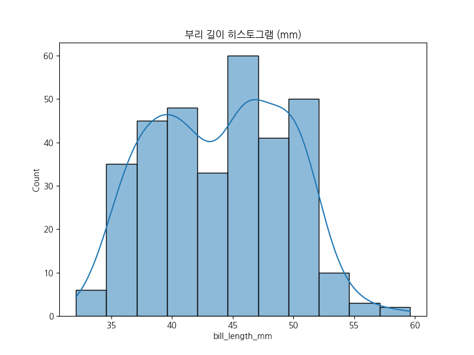

**인사이트:** Adelie 펭귄이 가장 작은 부리를 가지고 있으며, Gentoo가 가장 큽니다. 이는 먹이 습관 차이를 반영합니다.

::: notes
부리 길이의 분포를 보면, Adelie 종이 평균적으로 작은 부리를 가지고 있고, Gentoo 종이 큰 부리를 가지는 경향이 있습니다. 이는 각 종의 먹이 전략, 예를 들어 Gentoo의 경우 더 큰 물고기를 잡기 위한 적응으로 볼 수 있습니다. 이 그래프는 종별 차이를 시각적으로 잘 보여줍니다.
:::

---

# 시각화 2: 부리 깊이 히스토그램

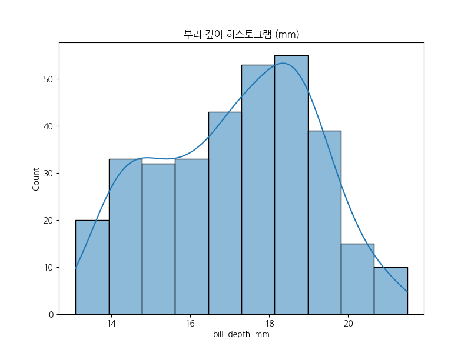

**인사이트:** Chinstrap이 가장 깊은 부리를 가지며, 크릴 잡기에 특화되어 있습니다.

::: notes
부리 깊이 히스토그램에서는 Chinstrap 펭귄이 가장 깊은 부리를 가지고 있어, 크릴이나 작은 해산물을 효율적으로 잡는 데 유리합니다. 반면 Adelie와 Gentoo는 상대적으로 얕은 부리를 가지며, 다양한 먹이원을 섭취할 수 있는 유연성을 제공합니다. 이 차이는 서식 환경에 따른 진화적 적응을 반영합니다.
:::

---

# 시각화 3: 날개 길이 히스토그램

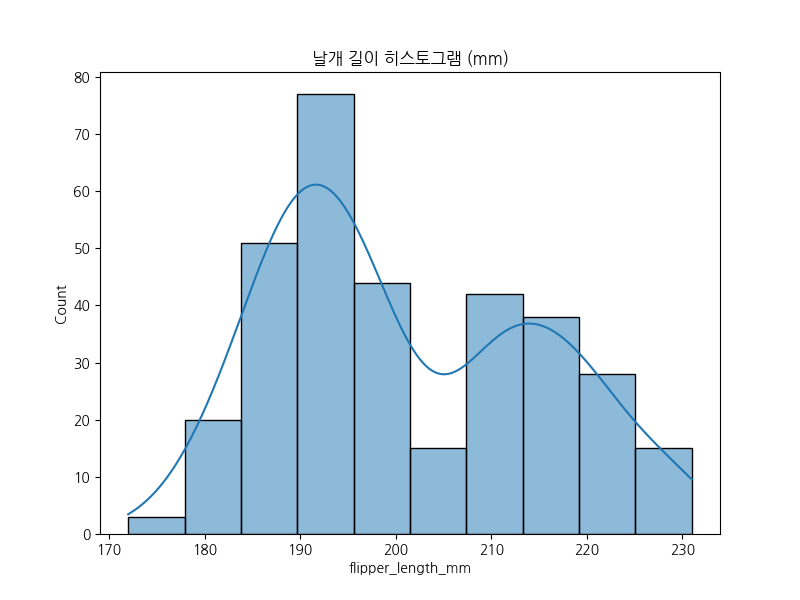

**인사이트:** Gentoo의 날개가 가장 길어 수영에 유리합니다.

::: notes
날개 길이의 분포를 분석하면, Gentoo 펭귄이 가장 긴 날개를 가지고 있어 빠른 수영 속도를 낼 수 있습니다. 이는 Biscoe 섬의 깊은 바다 환경에 적응한 결과로 보입니다. Adelie와 Chinstrap은 비슷한 날개 길이를 가지며, Dream 섬의 얕은 바다에서 활동하는 데 적합합니다. 날개 길이는 펭귄의 이동성과 생존에 중요한 요소입니다.
:::

---

# 시각화 4: 체중 히스토그램

**인사이트:** Gentoo가 가장 무겁고, 수컷이 암컷보다 무겁습니다.

::: notes
체중 분포에서는 Gentoo 펭귄이 평균적으로 가장 무겁고, Adelie가 가장 가볍습니다. 이는 체형 차이와 관련이 있으며, Gentoo의 큰 체중은 더 많은 지방 저장과 긴 수영 거리를 지원합니다. 또한 성별 차이를 고려하면, 수컷이 암컷보다 무거운 경향이 있어 성적 이형성을 보여줍니다. 체중은 펭귄의 건강과 번식에 영향을 미칩니다.
:::

---

# 시각화 5: 종별 부리 길이 박스플롯

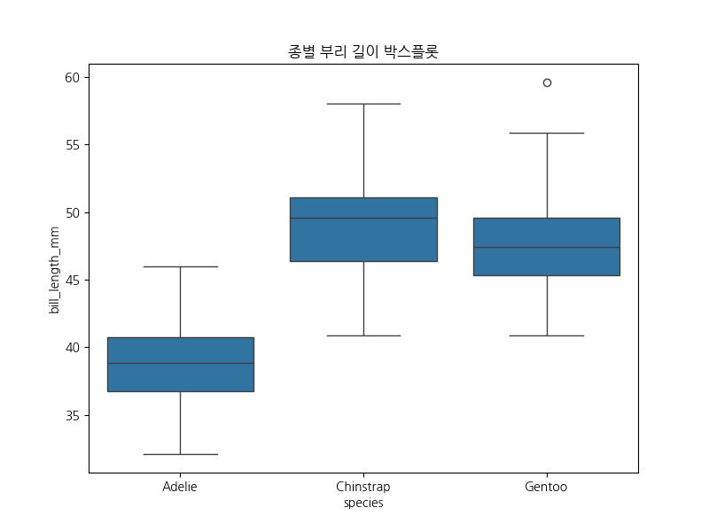

**인사이트:** Gentoo의 부리가 가장 길고 일관적입니다.

::: notes
종별 부리 길이 박스플롯에서 Gentoo의 부리가 가장 길고, 분산이 적어 일관된 특징을 가집니다. 이는 종의 안정적인 진화를 나타냅니다. Adelie는 가장 짧은 부리를 가지며, 이상치들은 개체 차이나 측정 오류를 시사할 수 있습니다. 박스플롯은 중앙값과 분포를 한눈에 볼 수 있어 비교에 유용합니다.
:::

---

# 시각화 6: 종별 부리 깊이 박스플롯

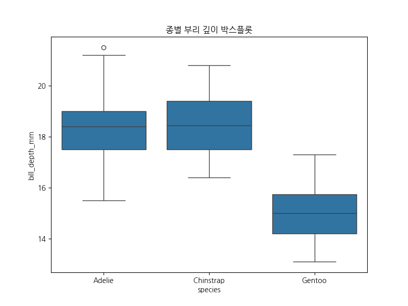

**인사이트:** Chinstrap이 가장 깊고, Gentoo가 얕습니다.

::: notes
부리 깊이 박스플롯에서는 Chinstrap이 가장 깊은 부리를 가지며, 이는 크릴 중심의 식단을 반영합니다. Gentoo는 가장 얕은 부리를 가지며, 다양한 먹이원을 섭취하는 전략입니다. 박스의 범위가 좁은 것은 종 내 일관성을 보여줍니다. 이 그래프는 먹이 습관에 따른 부리 형태의 차이를 명확히 합니다.
:::

---

# 시각화 7: 부리 길이 vs 깊이 산점도

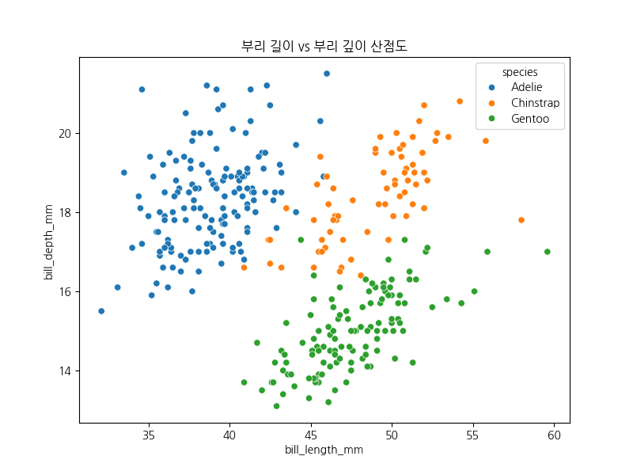

**인사이트:** 종별 클러스터링이 명확합니다.

::: notes
부리 길이와 깊이의 산점도에서 각 종이 명확한 클러스터를 형성하고 있습니다. Gentoo는 길고 얕은 부리, Chinstrap은 짧고 깊은 부리를 가집니다. 이는 독립적인 특징으로, 상관관계는 약하지만 의미 있습니다. 산점도는 변수 간 관계를 시각화하여 종 분류에 도움이 됩니다.
:::

---

# 시각화 8: 날개 길이 vs 체중 산점도

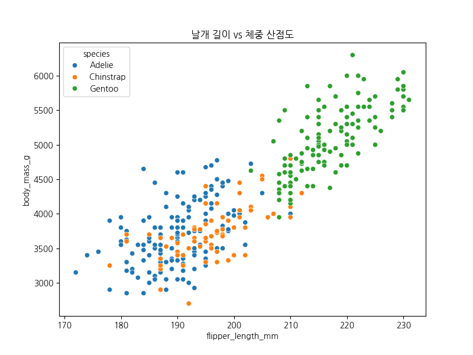

**인사이트:** 강한 양의 상관관계가 있습니다.

::: notes
날개 길이와 체중의 산점도는 강한 양의 상관관계를 보여, 큰 펭귄이 긴 날개를 가집니다. Gentoo가 우상단에 위치하며, 이는 효율적인 수영을 위한 진화입니다. 성별 차이도 보이지만, 종 차이가 더 두드러집니다. 이 관계는 펭귄의 생태적 적응을 이해하는 데 중요합니다.
:::

---

# 시각화 9: 종별 개수 막대그래프

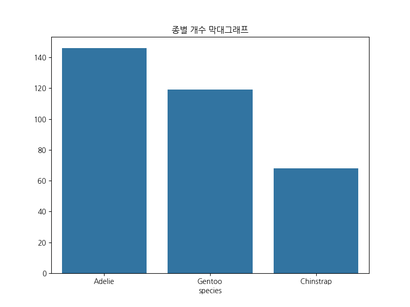

**인사이트:** Gentoo가 가장 많고, 섬별 분포 차이가 있습니다.

::: notes
종별 개수 막대그래프에서 Gentoo가 가장 많은 샘플을 가지고 있고, Adelie와 Chinstrap이 비슷합니다. 이는 섬별 서식지 분포를 반영하며, Biscoe 섬의 Gentoo가 많습니다. 데이터 불균형은 분석 시 고려해야 합니다. 이 그래프는 데이터의 대표성을 평가하는 데 유용합니다.
:::

---

# 교차표: 종 vs 섬

| 섬          | Biscoe | Dream | Torgersen |
|-------------|--------|-------|-----------|
| Adelie      | 44     | 55    | 47        |
| Chinstrap   | 0      | 68    | 0         |
| Gentoo      | 119    | 0     | 0         |

**인사이트:** 각 종이 특정 섬에 집중되어 있습니다.

::: notes
교차표를 보면, Gentoo는 Biscoe 섬에만 서식하고, Chinstrap은 Dream 섬에 집중되어 있습니다. Adelie는 모든 섬에 분포되어 있어 가장 적응력이 높습니다. 이는 섬의 환경 차이(깊이, 먹이원)가 종 분포를 결정짓는 요인임을 보여줍니다. 이 표는 서식지 선택의 패턴을 분석합니다.
:::

---

# 피봇테이블: 평균 체중 (종 x 성별)

| 종          | 암컷   | 수컷   |
|-------------|--------|--------|
| Adelie      | 3369   | 4043   |
| Chinstrap   | 3528   | 3939   |
| Gentoo      | 4680   | 5485   |

**인사이트:** 수컷이 암컷보다 무겁고, Gentoo 차이가 큽니다.

::: notes
피봇테이블에서 수컷이 암컷보다 평균 체중이 높으며, Gentoo의 차이가 가장 큽니다. 이는 성적 이형성으로, 수컷이 더 큰 체형을 가집니다. 종별로는 Gentoo가 가장 무겁고, 이는 영양 상태나 서식지 풍부함을 반영할 수 있습니다. 이 데이터는 번식 전략을 이해하는 데 도움이 됩니다.
:::

---

# 시각화 10: 종별 체중 바이올린 플롯

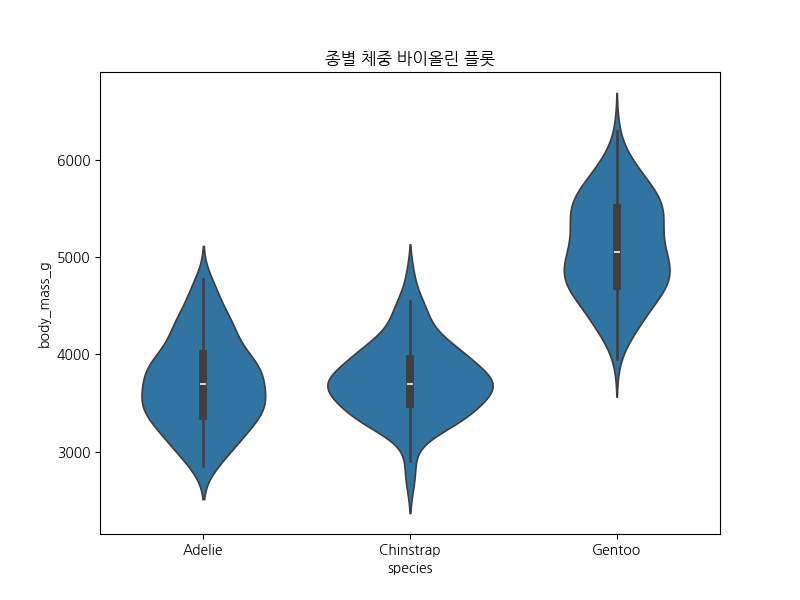

**인사이트:** Gentoo 분포가 넓고 평균 높습니다.

::: notes
바이올린 플롯에서 Gentoo의 체중 분포가 넓고 평균이 높습니다. Chinstrap은 좁은 분포를 가지며, 이는 서식지 안정성을 시사합니다. 성별 차이를 고려하면, 수컷의 분포가 더 넓어 다양성을 보여줍니다. 이 그래프는 분포의 모양을 자세히 볼 수 있어 통계적 비교에 적합합니다.
:::

---

# 시각화 11: 페어 플롯

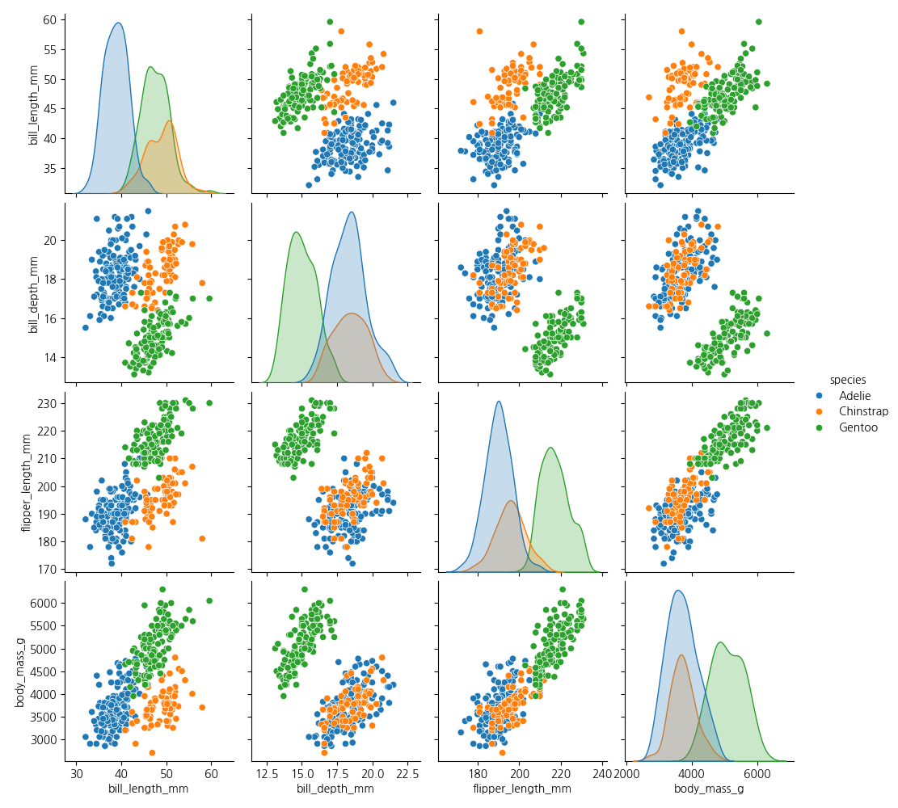

**인사이트:** 변수 간 관계를 종별로 보여줍니다.

::: notes
페어 플롯은 모든 변수 간 관계를 종별로 시각화합니다. Gentoo가 큰 체형을 가짐을 확인할 수 있습니다. 대각선 히스토그램은 정규 분포를 띠며, 산점도는 상관관계를 보여줍니다. 이는 종 분류와 회귀 분석에 유용하며, 데이터의 전체적인 패턴을 파악합니다.
:::

---

# 시각화 12: 상관관계 히트맵

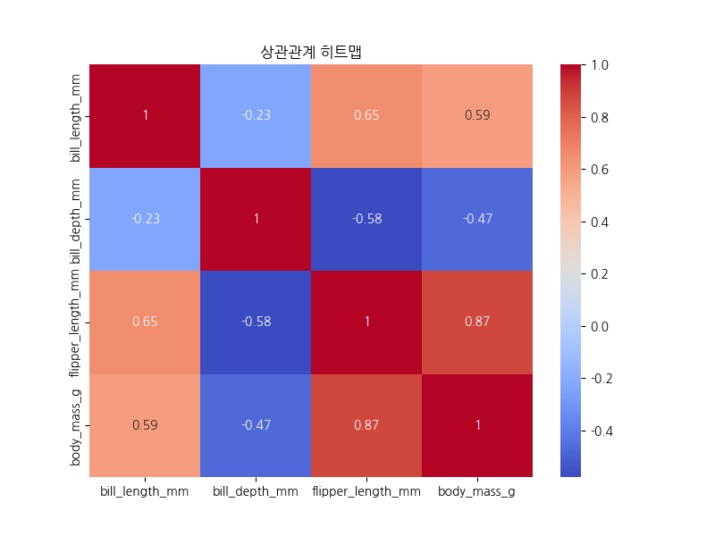

**인사이트:** 날개 길이와 체중의 상관계수가 높습니다.

::: notes
히트맵에서 날개 길이와 체중의 상관계수가 높아, 큰 펭귄이 긴 날개를 가집니다. 부리 길이와 깊이는 약한 상관관계를 가지며, 이는 독립적인 특징임을 시사합니다. 이 히트맵은 다중공선성을 피하기 위한 변수 선택에 도움이 되며, 변수 간 관계를 한눈에 볼 수 있습니다.
:::

---

# 분석 요약

- 데이터셋: 333개 샘플, 3종 펭귄
- 주요 차이: Gentoo가 크고 무거움
- 인사이트: 서식지와 먹이에 따른 적응

::: notes
분석을 요약하면, 333개의 펭귄 데이터를 통해 세 종의 차이를 분석했습니다. Gentoo가 가장 크고 무거운 특징을 가지며, 이는 서식 환경에 따른 적응입니다. 인사이트를 통해 펭귄의 생태를 더 깊이 이해할 수 있었습니다. 이 분석은 생물 다양성 연구에 기여할 수 있습니다.
:::

---

# 결론

펭귄 데이터 분석을 통해 종별 차이를 이해했습니다. 추가 연구로 생태계 보존에 기여할 수 있습니다.

::: notes
결론적으로, 이 분석을 통해 펭귄 종별 차이를 명확히 했습니다. 데이터 시각화와 통계 분석을 통해 얻은 인사이트는 생태계 보존과 기후 변화 연구에 유용할 것입니다. 앞으로 더 많은 데이터를 활용한 심층 분석을 기대합니다. 감사합니다.
:::

---

# Q&A

질문 있으신가요?

::: notes
이제 질의응답 시간을 갖겠습니다. 발표 내용에 대해 궁금한 점이 있으시면 언제든지 질문해 주세요. 데이터 분석 방법, 인사이트 해석, 또는 추가 분석 아이디어 등 다양한 주제로 논의할 수 있습니다. 여러분의 피드백을 환영합니다.
:::